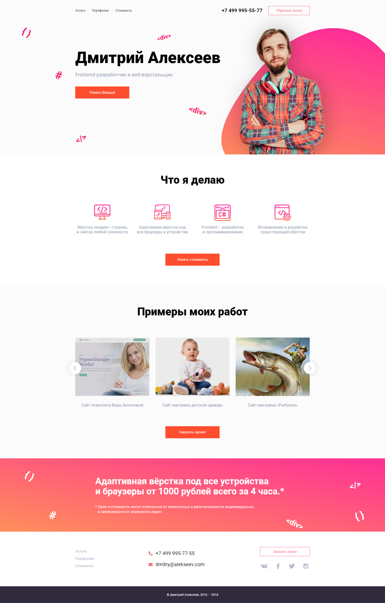

# personal-webstie

### Description

The personal website is fully responsive using HTML, CSS and jQuery a little bit.

### Layout

I used HTML5 semantic elements. All CSS code is written according to the BEM methodology.

### Adaptivity

I used [@media queries](https://developer.mozilla.org/en-US/docs/Web/CSS/@media) to ensure that all page elements display correctly at any screen size.

### Animations

Every animation on this site has been created using CSS transitions so they run smoothly.

### Preview

## Run & Build

This project is built using Gulp. You can run this site on your localhost after forking this repo, installing all dependencies **`npm i`** and typing in terminal **`gulp`**

This project is built using Gulp. You can fork this repo, by installing all dependencies of **`npm i`**, and run this site on your http://localhost:3000/ typing into terminal **`gulp`**

See additional Gulp settings in [gulpfile.js](https://github.com/KonstHardy/personal-webstie/blob/master/gulpfile.js)

